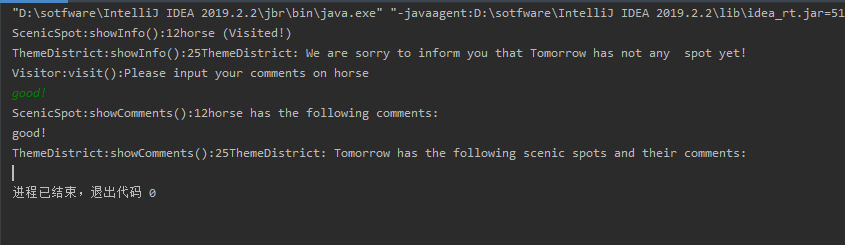
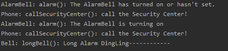
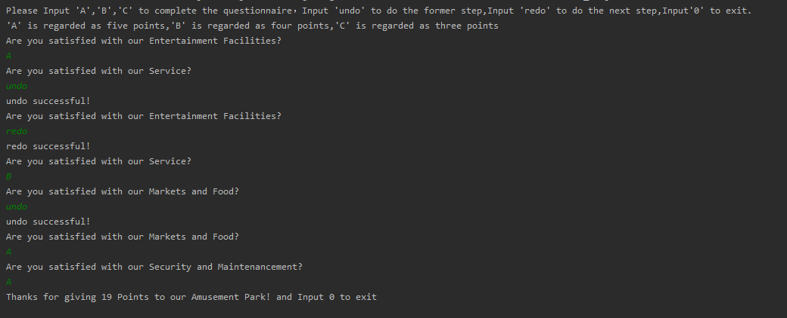

# 设计模式测试 

## 表格

| 编号 | 设计模式 | Class/interface API                                          | framework完成分 | Sample program | 备注说明 |
| ---- | -------- | ------------------------------------------------------------ | --------------- | -------------- | -------- |
| 1    | Visitor  | CommentsVisitor.visit(ScenicSpot scenicspot)；<br />CommentsVisitor.visit(ThemeDistrict themeDistrict);<br />RecordVisitor.visit(ScenicSpot scenicspot)；<br />RecordVisitor.visit(ThemeDistrict themeDistrict); | 70              | 30             |          |
| 2    | Command  | AlarmShort.execute()<br />AlarmLong.execute()                | 70              | 30             |          |
| 3    | Memento  | undo()<br />redo()                                           | 70              | 30             |          |

## 测试

### Visitor

#### 测试代码

```java
import CompositeAndVisitorAndIterator.*;

public class Main {
    public static void main(String[] args) {
        ScenicSpot scenicSpotA=new ScenicSpot("horse",false,"12") ;
        RecordVisitor recordVisitor=new RecordVisitor();
        recordVisitor.visit(scenicSpotA);
        ThemeDistrict themeDistrictB =new ThemeDistrict("Tomorrow",false,"25");
        recordVisitor.visit(themeDistrictB);
        CommentVisitor commentVisitor=new CommentVisitor();
        commentVisitor.visit(scenicSpotA);
        commentVisitor.visit(themeDistrictB);
    }
}
```

#### 测试截图



#### 评价

对于Visitor设计模式的使用十分熟练。其将算法visit与其操作对象ScenicSpot和ThemeDistrict隔离开进行操作，将Visitor设计模式应用于乐园的不同景点以及次级主题公园的打卡评论功能。且其与Composite和Iterator两种设计模式的组合使用，能让其对整个组合模式树执行操作，同时极为方便的遍历复杂数据结构， 并对其中的元素执行所需操作。

### Command

#### 测试代码

```java
import ObserverAndCommand.*;

public class testCommand {
    public static void main(String[] args) {
        AlarmSystem alarmSystem=new AlarmSystem();
        alarmSystem.addAlarmBellCommand("longBell");
        alarmSystem.open();
    }
}
```

#### 测试截图



#### 评价S

AlarmLong和AlarmShort命令继承自响铃命令抽象类BellCommand，响铃命令继承自命令抽象类Command。与Observer设计模式组合使用，可以动态地订阅或取消接收请求，并根据请求不同将方法参数化、 延迟请求执行或将其放入队列中。

### Memento

#### 测试代码

```java
import StateAndMemento.*;
public class testMemento {
    public static void main(String[] args) {
        Questionnaire questionnaire=new Questionnaire();
        questionnaire.fillInQuestionnaire();
    }
}
```

#### 测试截图



#### 评价

将Memento模式应用于问卷调查，每回答一次问题会更新问卷的状态，并会把状态记录在Memento中。使用undo和redo来获取问卷的上一步/下一步状态。符合Memento设计模式的预期。